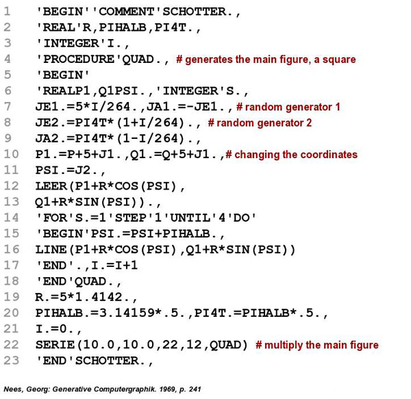

# Schotter Four Ways

*Schotter* (German for gravel) is a piece by computer art pioneer Georg Nees. It consists of a grid of squares 12 across and 22 down with random rotation and displacement that increases towards the bottom.


The original was created using a pen plotter. I don't know if Dr. Nees had access to a graphics terminal (fairly rare at the time) to preview the result or if he tried different random seeds before choosing this as the final.

I was able to find the original ALGOL code he used to create this, or at least the main part of it; it appears to use procedures he wrote that aren't included in this listing. It is from his book *Generative Computergraphik*, published in 1969 (in German) and which is no longer in print.



Other generative artists have taken inspiration from this work. One I particularly like is *Boxes I* by William Kolomyjec. It is similar to Schotter except that the disruption increases towards the center instead of towards the bottom.


*Schotter* is fairly simple to code; at least it is today with modern graphics libraries. Several other people have written tutorials for how to code this using various platforms. I'm adding to this collection with a series of tutorials for coding it in Rust using the Nannou library.

We'll be coding *Schotter* four different ways, each building on the previous version:

[Schotter1](schotter1.md): Using the Nannou "sketch" facility to code a simple version with no frills.

[Schotter2](schotter2.md): Changing the code to a Nannou "app" with persistent data and some simple keyboard commands to adjust some parameters.

[Schotter3](schotter3.md): Adding a control panel to make it easier to adjust parameters on the fly.

[Schotter4](schotter4.md): Animating the squares, so they move from the starting grid to their displaced positions, and from there to new positions.

I may add some variations later; after all, that's what creative coding is all about! But this is the initial plan.


## Notes
Things I want to remember for now, and may formally incorporate later.

I created the Rust workspace with the following commands:
* mkdir schotter
* cd schotter
* git init -b main

Then I created four files:
* .gitignore
  ```
  /target
  Cargo.lock
  ```
* Cargo.toml
  ```
  [workspace]

  members=[
  ]
  ```
* LICENSE.txt, containing the standard MIT license.
* README.md (this file), with initial text.

Finally, I did my initial commit.

To create schotter1, I did the following:
* add "schotter1", to the main Cargo.toml file, in "members".
* run "cargo new schotter1"
* in schotter1/Cargo.toml, added 'nannou = "0.16"' as a dependency (run "cargo search nannou" to determine latest version)
* copied the contents of the Nannou template template_sketch.rs (https://github.com/nannou-org/nannou/blob/master/examples/templates/template_sketch.rs) to schotter1/src/main.rs (replacing default hello world code)
* did initial compile with "cargo run --release -p schotter1" (took several minutes to complete)
* created schotter1.md to contain the first tutorial

Creation of subsequent versions will be similar, but copying the initial code from the previous version instead of the Nannou template.
