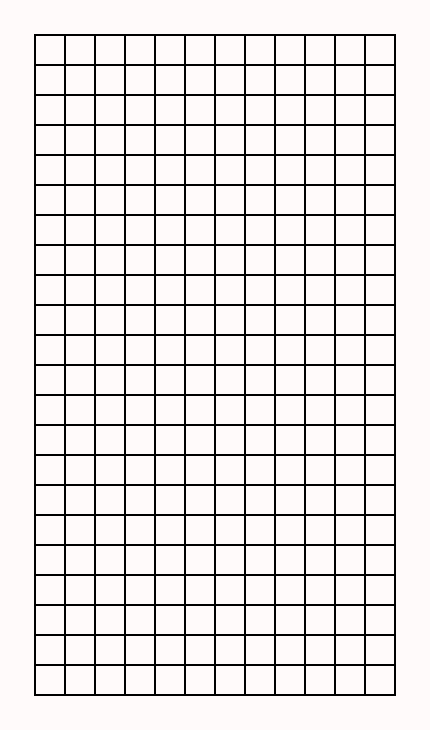
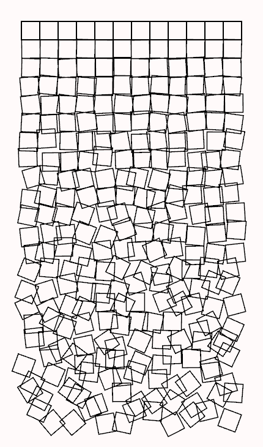

# Schotter 1: Quick Sketch

We'll make our first implementation of Schotter in two iterations. First, we'll just draw a grid of squares with no distortion, then we'll distort each square according to its position in the grid. But before we start coding, let's consider what coordinate system to use. Although we could just use the coordinate system Nannou provides by default (which isn't difficult for this program), choosing a more natural coordinate system can simplify the code.

It also makes it easier to port the code to another system if needed. For example, the Nannou coordinate system has the origin (0,0) in the center with increasing *y* values going up. Many other creative coding platforms have the origin (0,0) in the upper left corner with increasing *y* values going down. If we use a natural coordinate system in our code and wanted to port it to one of these platforms, we would only need to change the coordinate system mapping in one place instead of throughout our code.

For a grid of squares, one logical coordinate system (and the one we will use) is to set the origin to the center of the top left square, with one unit being the size of a side of the square, *x* going right, and *y* going down. So the top left square is centered at (0.0, 0.0), the one to its right is centered at (1.0, 0.0), and the one below it is centered at (0.0, 1.0). For the 12 by 22 grid we will be starting with, the bottom right square is centered at (11.0, 21.0). Note that the coordinate system uses floating point numbers (specifically the Rust f32 type). This is essential since the distortions will move the squares fractions of a unit.

It is very common in computer graphics to use multiple coordinate systems, using different systems in different places depending on what is most logical in the context. That will apply here too. Just drawing a square in its "home" position is easy enough using the grid coordinates: draw a square of size 1 at (x, y). But we eventually want to rotate and move the squares, and that will be easier if we change the coordinate system so the origin is at the home position for the particular square. Then we can draw a square of size 1, rotated by some (random) angle θ, with a random offset (a, b).

This may seem a bit confusing, but Nannou makes it easy to use a different coordinate system (at least different rectangular coordinate systems; using systems like polar coordinates is more difficult, but we won't be doing that here). Before we get to how this is done, let's set up our first Schotter project.

Since we are using a Rust workspace, the first step is to edit the workspace cargo.toml file and add the new project to the members list. We'll call it "schotter1", so the file now looks like this:

```
[workspace]
members=[
    "schotter1",
]
```

We then create the new project with the command ```cargo new schotter1```. That will create the folder "schotter1" with a "src" subfolder and the project Cargo.toml file. The next step is to make that a Nannou project by editing the project Cargo.toml file (the one in the schotter1 folder, not the workspace one we modified earlier) to add Nannou as a dependency. For this project, we will use Nannou version 0.18, so we add the following to the end of schotter1/Cargo.toml, after ```[dependencies]```:

```
[dependencies]
nannou = "0.18"
```

Nannou is updated frequently with new features and bug fixes, so when you start a new project, you may want to be sure you are using the latest version of Nannou. You can look that up with the command ```cargo search nannou```. The output will contain a line such as the following:

```
nannou = "0.18.0"             # A Creative Coding Framework for Rust.
```

When I wrote this in May 2021, the latest version was 0.16.0, but a new version was released the next month so I updated this tutorial to use 0.17.0. This actually required changing some of the code since the parameters for the random number generator function gen_range() changed (we'll see this in schotter2). When version 0.18.0 was released five months later, yet more changes were needed. Specifying the exact version of the libraries in Cargo.toml prevents changes like this from breaking our code when libraries are updated.

The "cargo new" command created a simple Rust program in the file main.rs in the src directory. We now need to replace that with a Nannou starting point. Since we're starting from scratch here, let's use one of the Nannou templates from https://github.com/nannou-org/nannou/tree/master/examples/templates. There are two kinds of Nannou projects: sketches and apps. Sketches can't track application state or use some of the advanced Nannou features, but are much simpler so we'll start there. (Apps are more flexible and allow more control; we'll convert to the app model in the next version, schotter2.)

The template for a new Nannou sketch is ```template_sketch.rs```. Click that file name and copy the Rust code. Then open main.rs, delete the simple Rust program that cargo put there, and paste in the sketch template code. It looks like this:

```
use nannou::prelude::*;

fn main() {
    nannou::sketch(view).run()
}

fn view(app: &App, frame: Frame) {
    let draw = app.draw();
    draw.background().color(PLUM);
    draw.ellipse().color(STEELBLUE);
    draw.to_frame(app, &frame).unwrap();
}
```

The final setup step is to compile the template using the command ```cargo run -p schotter1```. This will take several minutes the first time it is run since it needs to compile Nannou and all of the libraries that it uses. Subsequent compiles will complete much more quickly.

When it's finished, a window will appear containing a blue circle on a plum background. Not very exciting, but it shows that the environment is working. Press 'Esc' to exit.

Let's go through the sketch template line by line to see how it works. The first line tells Rust to use the Nannou Prelude, a collection of commonly used Nannou items that we can now use directly; this is a lot easier than prefixing them all with "nannou::*whatever*::".

Function main is where Rust starts the program. Its single line says to create a Nannou sketch using "view" as its view function, and run it. Nannou executes the view function repeatedly until the application is quit. The view function can have any name, but is normally named "view".

Function view() implements the main logic of the sketch. For sketches, it has two parameters, an App and a Frame, which we assign to variables app and frame. The App contains the Nannou context, including the APIs and windows. The Frame is where we draw graphics that are then displayed on the screen.

The first line of view assigns the application's Draw interface to the variable "draw". The other three lines then use this Draw interface to perform drawing operations: setting the background to "PLUM", drawing a "STEELBLUE" circle, and finally rendering the previous commands to the Frame (and thus displaying them on the screen).

The last "draw.to_frame" line is used just like this in most every Nannou program. It takes all the draw operations and actually renders them to the frame so they will be displayed.

The template is a great starting point, and running it shows we have everything set up correctly. Now we'll change it to draw something that looks like Schotter. 

First, in the view function, the "draw.background" line is useful, but let's change "PLUM" to "SNOW" to make a white background (but not completely white). 

```
draw.background().color(SNOW);
```

We don't need a circle, so let's delete the "draw.ellipse" line; we'll code the schotter logic in its place.

```diff
-draw.ellipse().color(STEELBLUE);
```

Before we start coding the schotter logic, we need to set up the coordinate system we want to use. The Draw interface we get from the App will have the origin in the center with a scale of one pixel per unit, positive *x* to the right, and positive *y* to the top. We need to rescale that coordinate system to have *size* pixels per unit (*size* is the length of each side of the squares), move the origin to where we want to put the top left square, and flip *y* so positive values go down. Now is the time to do that!

First, we need to decide how big we want our squares to be, in pixels. Let's start with 30 pixels. To make things easy to adjust later, let's define some constants at the beginning of the code to define the basic parameters.

```
const ROWS: u32 = 22;
const COLS: u32 = 12;
const SIZE: u32 = 30;
const MARGIN: u32 = 35;
const WIDTH: u32 = COLS * SIZE + 2 * MARGIN;
const HEIGHT: u32 = ROWS * SIZE + 2 * MARGIN;
```

Once we know the number of rows and columns of squares and the size of each square (we also added a margin), we can compute the width and height of the window needed to show them. To set the size of the Nannou window, we add an additional function to our sketch call in function main, like this:

```
  nannou::sketch(view).size(WIDTH, HEIGHT).run()
```

We'll also set the loop mode. By default, the view function gets called repeatedly, allowing animations. But we aren't animating; we just want it to run one time. We can set this in main by adding an additional item to the sketch, like this:

```
nannou::sketch(view).size(WIDTH, HEIGHT).loop_mode(LoopMode::loop_once()).run()
```

This uses the Rust builder pattern, where a structure is built using functions that are chained together. It is especially useful for specifying optional parameters, like the size of the sketch window here. Size is the only thing you can specify for sketch (besides run, which actually starts the sketch), but some constructs have a lot more. Draw has several dozen!

In particular, Draw implements the following functions (among others) that we can use to transform the default coordinate system to the one we want to use:
* scale(s) - scale the x and y (and z) axes by s
* scale_x(s) - scale only the x axis by s
* scale_y(s) - scale only the y axis by s
* xy(v) - translate the origin by a 2D vector v
* x_y(x, y) - translate the origin by (x, y)
* x(x) - translate the origin along the x axis by x
* y(y) - translate the origin along the y axis by y
* rotate(r) - clockwise rotation by r radians

We won't need to rotate, so we'll ignore that one, but we do need to scale and translate to get the coordinate system we want. We can choose to translate then scale, or to scale then translate, but the translation values will be different. If we translate first, we use unscaled coordinates; if we scale first, we use scaled coordinates. Scaling first is usually the most logical, and is what we will do.

We need to change from 1 pixel per unit to SIZE pixels per unit, so we use ```scale(SIZE as f32)``` (all these functions take floating point arguments). We also want to flip y so that positive values go down instead of up. We do this by scaling y by -1: ```scale_y(-1.0)```. The scale is now what we want, but the origin is in the center, between squares, instead of the middle of the top left square, so we translate x by COLS/2 + 1/2 and y by ROWS/2 + 1/2 (the 1/2 is to move it from the corner to the center of the square). But we first need to convert the integers to floating point: ```x_y(COLS as f32 / -2.0 + 0.5, ROWS as f32 / -2.0 + 0.5)```. We chain these together and assign the result to a new variable gdraw (for grid draw), like this:

```
    let draw = app.draw();
    let gdraw = draw.scale(SIZE as f32)
                  .scale_y(-1.0)
                  .x_y(COLS as f32 / -2.0 + 0.5, ROWS as f32 / -2.0 + 0.5);
```

The three builder functions are split into multiple lines for readability; this is standard style when using builder patterns in Rust.

So now we have two Draw interfaces:
* draw, using the standard Nannou coordinate system
* gdraw, using our custom grid coordinate system

We can use either one to draw objects, depending on which coordinate system we need. Note that this is a big difference between Nannou and other creative coding libraries that have global functions like ellipse() and rect() to draw objects using the "current" drawing state. It is a bit harder to use since you always need to specify a draw interface to use. But on the other hand, there is no need for push or pop functions to make temporary changes to the drawing state and restore it when done. I personally really like the Nannou paradigm.

Before making a grid, let's do a quick check to make sure we have everything right so far by drawing a single square at (0, 0) (the top left corner). We will need one more constant: the width of the lines that form the squares. Since the width of a square is 1, this is the fraction of the square width used for the lines. We'll start with 6% or 0.06 with the line:
```
const LINE_WIDTH: f32 = 0.06;
```

Drawing a square is done with the rect() function, which also uses the Rust builder pattern. Here is the code (I like to put the semi-colon on its own line when writing these so I don't forget or lose it when adding or removing builder functions):

```
gdraw.rect()
    .no_fill()
    .stroke(BLACK)
    .stroke_weight(LINE_WIDTH)
    .w_h(1.0, 1.0)
    .x_y(0.0, 0.0)
    .rotate(0.0)
    ;
```

Running this (with ```cargo run -p schotter1```), we see one square at the top left, just like we expect. Press 'Esc' to exit.

To make a grid of squares, we use a couple of nested loops. We'll also create a new draw function ```cdraw``` (for cell draw) with the coordinate system centered on the square we are drawing.

```
for y in 0..ROWS {
    for x in 0..COLS {
        let cdraw = gdraw.x_y(x as f32, y as f32);
        cdraw.rect()
            .no_fill()
            .stroke(BLACK)
            .stroke_weight(LINE_WIDTH)
            .w_h(1.0, 1.0)
            .x_y(0.0, 0.0)
            .rotate(0.0)
            ;
    }
}
```



The final step is to randomly move and rotate each square. We want the top to be affected less than the bottom, so we first compute a factor between 0 and 1 based on the vertical distance from the top. Then we call the Nannou random_range() function three times to get the x offset, the y offset, and the rotation. The offsets are between -0.5 and 0.5 to get a possible range of one unit. The rotation is between -π/4 and π/4 radians (-45° and 45°) since squares have four-fold rotational symmetry. Then we add these in the rect() call.

```
let factor = y as f32 / ROWS as f32;
let x_offset = factor * random_range(-0.5, 0.5);
let y_offset = factor * random_range(-0.5, 0.5);
let rotation = factor * random_range(-PI / 4.0, PI / 4.0);
cdraw.rect()
    .no_fill()
    .stroke(BLACK)
    .stroke_weight(LINE_WIDTH)
    .w_h(1.0, 1.0)
    .x_y(x_offset, y_offset)
    .rotate(rotation)
    ;
```

And we're done! The result is, of course, different from what Georg Rees got; indeed it will be different each time the program is run. That's the fun of generative art.



Next tutorial: [Schotter2](schotter2.md)
