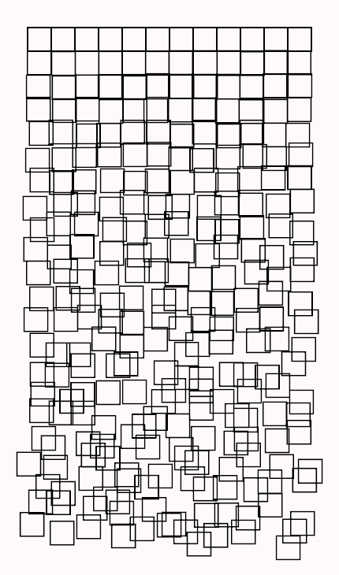

# Schotter2: Adding parameters

With schotter1, we made a very basic program that just generated a pattern, displayed it on the screen, and waited for us to close the program. To get a different pattern, we need to re-run the program. To tweak the design, we need to change the code and recompile it. This is basically what Georg Nees had to do! But modern technology lets us do better.

The goal of schotter2 is to add some parameters to schotter1 so we can try different patterns and make some design adjustments while the program is running. This make it much easier to find nice designs. For now, we will limit our interaction to key presses; we'll make a more convenient control panel in schotter3.

Specifically, we want to implement the following commands by pressing the appropriate keys:
* R: randomize the pattern (like re-running schotter1)
* S: save the current pattern as a PNG file with the name schotter2.png
* up/down arrows: increase/decrease the square displacement
* right/left arrows: increase/decrease the square rotation

Doing this requires converting our Nannou sketch to a Nannou app, which can store persistent data used to generate designs. The process for doing this is easy, and described in the [Nannou Guide](https://guide.nannou.cc/tutorials/basics/sketch-vs-app.html#switching-from-sketch-to-app). We'll use a slightly different process that adds some flexibility.

The first step is to create a new project in our Rust workspace using the same steps as for schotter1. Add "schotter2" to the members list in the workspace Cargo.toml file, which now looks like this:

```
[workspace]

members=[
    "schotter1",
    "schotter2",
]
```

Then create the new project with the command ```cargo new schotter2```, which will create the directory "schotter2" with a "src" subdirectory and the project Cargo.toml file. Add Nannou as a dependency by adding ```nannou = "0.16.0"``` to the end of schotter2/Cargo.toml just as we did for schotter1/Cargo.toml. (Use the same version as before; 0.16.0 was the latest available when I wrote this.)

Now the process changes slightly. Instead of replacing the initial contents of schotter2/src/main.rs with a Nannou template, copy the contents of schotter1/src/main.rs to it. Now compile and run the program with the command ```cargo run -p schotter2```. It will work exactly the same as schotter1 did (since it is exactly the same code).

Now we switch schotter2 from a Nannou sketch to a Nannou app using the following steps:

1. Change the single statement in function main().

Old:
```
nannou::sketch(view).size(WIDTH, HEIGHT).run()
```
New:
```
nannou::app(model).update(update).run();
```

2. Add a "Model" struct to contain the persistent data we will use. We can call it whatever we want, but we'll follow the convention and use "Model". It doesn't contain anything yet; we'll add fields to it shortly.
```
struct Model {}
```

3. Create a "model" function for creating the model. It is used for other initial setup as well, such as setting the loop mode and creating the Nannou window. This function is the argument to the ```app(model)``` we added to function main(). Again, we can call it anything, but the convention is to use "model". It takes one parameter, the Nannou App, and returns a Model struct.
```
fn model(app: &App) -> Model {
    app.set_loop_mode(LoopMode::wait());
    let _window = app.new_window()
                .title("Schotter2")
                .size(WIDTH, HEIGHT)
                .view(view)
                .build()
                .unwrap();
    Model {}
}
```

4. Add a Model parameter to the "view" function so it can access the data in the model.

Old:
```
fn view(app: &App, frame: Frame) {
```
New:
```
fn view(app: &App, _model: &Model, frame: Frame) {\
```

5. Remove the set_loop_mode statement from the beginning of the view function. It's cleaner to set the loop mode in the model function in an app since it is part of the app setup. (Sketches only have a view function, so that's where we put it.)

6. Create an "update" function that is called in each iteration to update the data in the model. Right now, we have nothing to update, so the body is blank.
```
fn update(_app: &App, _model: &mut Model, _update: Update) {}
```

Our Nannou sketch is now an app! It's a good idea to compile and run it to make sure there aren't any typos or other errors. We didn't change any logic, but we did make one change: the loop mode is now "wait" instead of "loop_once". We need to loop more often so that parameter changes will take effect. Loop mode wait means to run the loop (the update and view functions) only after user input events. So as long as you don't touch the keyboard or mouse, the program will run the same as before.

But simply moving the mouse will randomize the square positions, and that's annoying. It's the reason we set the loop mode to loop_once in schotter1! To fix this, we need to exert more control over the random number generator; specifically, we need to control the seed it uses.

Random number generators (RNGs) compute a stream of numbers that are statistically random. The numbers aren't really random like flipping coins or rolling dice are, but they are often used to simulate such things so are very useful for things like games and generative art. RNGs can be initialized with a "seed", which is just a number to get it started. When re-initialized with the same seed value, a RNG will generate exactly the same sequence. This is just what we need! If we set the RNG seed to some value on each loop iteration before we use the random numbers, we will produce the same results.

So the first variable we will add to our model is "random_seed", which has type u64. So our model definition becomes:

```
struct Model {
    random_seed: u64,
}
```

Whenever we change the Model, we need to change the model function to initialize this value. We'll start it with a random integer between 0 and 1,000,000. So the last line of function model is changed to the following:

```
    let random_seed = random_range(0, 1000000);
    Model {
        random_seed,
    }
```

The simple random number generator we used in schotter1 is included in the Nannou prelude, so we can use it directly. But to use the seedable RNG we need to add two additional use statements to the beginning of the program:

```
use nannou::prelude::*;
use nannou::rand::rngs::StdRng;
use nannou::rand::{Rng, SeedableRng};
```

Then, near the beginning of the view function where we set up the variables used in the function, we need to create a RNG from the seed, with this statement:

```
let mut rng = StdRng::seed_from_u64(model.random_seed);
```

Note that rng must be mutable; generating a random number changes the internal state to prepare for generating the next one. We also need to remove the underscore in front of "_model" in the function declaration since we will be using the parameter (beginning a variable with an underscore tells Rust that we know we aren't using it so it doesn't need to warn us):

```
fn view(app: &App, model: &Model, frame: Frame) {
```

Finally, we replace the three calls to "random_range()" with "rng.gen_range()" so we get random numbers from our seeded RNG instead of the standard one:

```
let x_offset = factor * rng.gen_range(-0.5, 0.5);
let y_offset = factor * rng.gen_range(-0.5, 0.5);
let rotation = factor * rng.gen_range(-PI / 4.0, PI / 4.0);
```

Finally, if we compile and run the program now it will work the same as schotter1. But now we can add new functionality.

Let's start with by making the 'R' key randomize the pattern by changing random_seed to a new random value. We first need to register a function that is called when a key is pressed in the window by adding the builder function ```key_pressed(key_pressed)``` to our new_window() call in model. It now looks like this:

```
let _window = app.new_window()
            .title("Schotter2")
            .size(WIDTH, HEIGHT)
            .view(view)
            .key_pressed(key_pressed)
            .build()
            .unwrap();
```

Then we add our key_pressed() function to the end of the program:

```
fn key_pressed(_app: &App, model: &mut Model, key: Key) {
    match key {
        Key::R => {
            model.random_seed = random_range(0, 1000000);
        }
        _other_key => {}
    }

}
```

This function is called whenever we press a key. It matches on the key we pressed; if it was 'R' we set random_seed to a new random number. Otherwise we ignore it. Now we don't need to quit and restart the program to get a new pattern; just press the 'R' key.

When we find a pattern we like, it's nice to be able to save the result. So let's make 'S' do that. We need access to the App, so we first remove the underscore from the first argument, then add a case to our match statement for 'S':

```
fn key_pressed(app: &App, model: &mut Model, key: Key) {
    match key {
        Key::R => {
            model.random_seed = random_range(0, 1000000);
        }
        Key::S => {
            app.main_window()
                .capture_frame(app.exe_name().unwrap() + ".png");
        }
        _other_key => {}
    }

}
```

Now we can add controls to fine tune the appearance of the result. There are lots of things we could do! We'll just make the arrow keys control how much the squares are displaced and rotated.

To do this, we need two more variables in the model, additional factors for the displacement and rotation:

```
struct Model {
    random_seed: u64,
    disp_adj: f32,
    rot_adj: f32,
}
```

Then we need to make the model function assign initial values; we'll start with 1.0 so the initial behavior is the same as before.

```
let random_seed = random_range(0, 1000000);
let disp_adj = 1.0;
let rot_adj = 1.0;
Model {
    random_seed,
    disp_adj,
    rot_adj,
}
```

Now we need to incorporate these in the code:

```
let factor = y as f32 / ROWS as f32;
let disp_factor = factor * model.disp_adj;
let rot_factor = factor * model.rot_adj;
let x_offset = disp_factor * rng.gen_range(-0.5, 0.5);
let y_offset = disp_factor * rng.gen_range(-0.5, 0.5);
let rotation = rot_factor * rng.gen_range(-PI / 4.0, PI / 4.0);
```

Finally, we add cases to the key_pressed() function to change the new variables (notice the check to keep the values positive):

```
Key::Up => {
    model.disp_adj += 0.1;
}
Key::Down => {
    if model.disp_adj > 0.0 {
        model.disp_adj -= 0.1;
    }
}
Key::Right => {
    model.rot_adj += 0.1;
}
Key::Left => {
    if model.rot_adj > 0.0 {
        model.rot_adj -= 0.1;
    }
}
```

We should make one more change: We don't currently keep any information about the states of the squares between iterations. This is fine since we regenerate the squares from scratch on each iteration. But the Nannou App paradigm supports keeping state information in the model, and doing this will make it easier to make future changes, especially adding animation. The initial state is created in the model() function along with other setup, and on each iteration the update() function is called to update the state before calling the view() function to display it.

The first thing we need to do is create a struct to hold information about individual squares. Since Schotter means "gravel", we'll call this struct Stone, and we'll include a new() function for it:

```
struct Stone {
    x: f32,
    y: f32,
    x_offset: f32,
    y_offset: f32,
    rotation: f32,
}

impl Stone {
    fn new(x: f32, y: f32) -> Self {
        let x_offset = 0.0;
        let y_offset = 0.0;
        let rotation = 0.0;
        Stone {
            x,
            y,
            x_offset,
            y_offset,
            rotation,
        }
    }
}
```

In our Model struct, we add a vector of Stones, named gravel:

```
struct Model {
    random_seed: u64,
    disp_adj: f32,
    rot_adj: f32,
    gravel: Vec<Stone>
}
```

We then add code to the model() function to create the initial stones. This will replace the nested for loops in view().:

```
let mut gravel = Vec::new();
for y in 0..ROWS {
    for x in 0..COLS {
        let stone = Stone::new(x as f32, y as f32);
        gravel.push(stone)
    }
}

Model {
    random_seed,
    disp_adj,
    rot_adj,
    gravel,
}
```

The update() function now has some work to do! Instead of nested loops for x and y, we just iterate through the model.gravel vector which contains the state of each square and set the offset and rotation variables using code adapted from the view() function:

```
fn update(_app: &App, model: &mut Model, _update: Update) {
    let mut rng = StdRng::seed_from_u64(model.random_seed);
    for stone in &mut model.gravel {
        let factor = stone.y / ROWS as f32;
        let disp_factor = factor * model.disp_adj;
        let rot_factor = factor * model.rot_adj;
        stone.x_offset = disp_factor * rng.gen_range(-0.5, 0.5);
        stone.y_offset = disp_factor * rng.gen_range(-0.5, 0.5);
        stone.rotation = rot_factor * rng.gen_range(-PI / 4.0, PI / 4.0);
    }
}
```

Finally, we edit the view() function to remove the code that was move elsewhere, keeping only the rect() call that draws the squares inside a new for loop that iterates through the model.gravel vector.

```
for stone in &model.gravel {
    gdraw.rect()
        .no_fill()
        .stroke(BLACK)
        .stroke_weight(LINE_WIDTH)
        .w_h(1.0, 1.0)
        .x_y(stone.x + stone.x_offset, stone.y + stone.y_offset)
        .rotate(stone.rotation)
        ;
}
```

That's all we'll do for this program. Now that you know the pattern for adding new functionality, add your own! Here's an output I got by decreasing the rotation adjustment to 0 (no rotation) and increasing the displacement adjustment:


