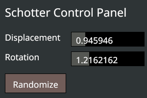
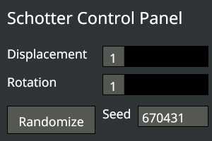

# Schotter3: Add a control panel

Now that we have added parameters to control some of the Schotter behavior, for schotter3 let's add a control panel with buttons and sliders to control these parameters. Importantly, the control panel will also display the current values, which can allow us to reproduce the exact image at a later date.

We still want to be able to save the generated image, and would like to do so without saving the control panel in the image, so we'll put the control panel in a second window. We start by creating that window.

The main window is created in the model function by calling new_window. We just copy that invocation and make a few changes to create a second window:

```
let ui_window = app.new_window()
            .title(app.exe_name().unwrap() + " controls")
            .size(300, 200)
            .view(ui_view)
            .event(ui_event)
            .key_pressed(key_pressed)
            .build()
            .unwrap();
```

Each window can have its own view and event functions. Here we use "ui_view" to display the control panel and "ui_event" to generate the controls and handle general events. We also use the same key_pressed function as for the main window so the keypresses we implemented in schotter2 will work even if the control panel window has the focus. The size is just a guess; we can adjust it later to make it fit the controls. Control panel development is often a process of trying some layout and then tweaking the placements and sizes to look right. We will need the window id when we create the User Interface, so we put it into a variable.

Next, we create the two functions we reference, leaving the bodies empty for now:

```
fn ui_event(_app: &App, _model: &mut Model, _event: WindowEvent) {}

fn ui_view(_app: &App, _model: &Model, _frame: Frame) {}
```

If we compile and run now, Rust will warn us that ui_window is unused, but two windows will be created: the main one with the Schotter design and a small blank one where our controls will go. But there is actually a subtle bug: if you press 'S' while the control panel window is active, that window will be saved instead of the main window. To see why, let's look at the save code:

```
Key::S => {
    app.main_window()
        .capture_frame(app.exe_name().unwrap() + ".png");
}
```

While "app.main_window()" seems like it should return the main window, it actually returns the active one. This is acknowledged in the Nannou docs: 'TODO: Currently this produces a reference to the focused window, but this behaviour should be changed to track the "main" window (the first window created?)'. So this will probably be fixed in the future, but we don't want to wait! To fix this, we need to remember the id of the main window and make the save code use it instead of app.main_window().

First, we add a new field to the model; let's call it "main_window".

```
struct Model {
    main_window: WindowId,
```

Then we modify the model function. Instead of storing the main window id in "_window", which is ignored since we don't need it when there is only one window, we store it in "main_window".

```
let main_window = app.new_window()
            .title("Schotter2")
```

And we include that in the model result:

```
Model {
    main_window,
```

Finally, we modify the save code to use the window associated with that window id as the window to save (checking that it is still open):

```
Key::S => {
    match app.window(model.main_window) {
        Some(window) => {
            window.capture_frame(app.exe_name().unwrap() + ".png");
        }
        None => {}
    }
}
```

Now we have a second window where we can put our control panel, so let's put a control panel in it. This will take quite a few steps, but adding new elements is fairly easy once we have the basic structure. To begin, let's put a single "Randomize" button in the middle which will randomize the random_seed (just like typing "R").

Nannou uses a library called Conrod for creating Graphic User Interfaces (GUIs). It uses a GUI style called "immediate mode", where the GUI elements (called "widgets") are created and drawn as part of the update/draw loop, which works very well for programs like generative art and games. (The alternative used by more traditional applications is "retained mode", where widgets are created during setup and maintained by the graphics library. This can be more efficient, but is also more complex since it requires synchronization between the data and widget states.)

To create a GUI in Nannou, we first add a use statement at the beginning for the Ui prelude:

```
use nannou::ui::prelude::*;
```

Each widget we will use needs to have an Id. We use a special macro to list the widgets and generate an Id for each. We start with one widget: the Randomize button:

```
widget_ids! {
    struct Ids {
        randomize,
    }
}
```

We then need to add two items to our model: one to store the GUI state and one to store a list of widget ids:

```
struct Model {
    ui: Ui,
    ids: Ids,
```

Then, of course, we need to initialize these items in our model function. The Ui is created using the app's new_ui() function, and the id list with the Ui widget_id_generator() function. Note that ui needs to be mutable since widget_id_generator() will modify it.

```
let mut ui = app.new_ui().window(ui_window).build().unwrap();
let ids = Ids::new(ui.widget_id_generator());
```

Next, we modify the UI background and "theme", which controls things like the widget colors. The defaults result in lots of black text on black backgrounds, which isn't at all readable. It is confusing and a bit annoying that the Nannou and UI functions use different and non-interchangable color definitions. But we'll live with it. We add these lines just below the previous ones:

```
ui.clear_with(nannou::ui::prelude::color::DARK_CHARCOAL);
let mut theme = ui.theme_mut();
theme.label_color = nannou::ui::prelude::color::WHITE;
theme.shape_color = nannou::ui::prelude::color::CHARCOAL;
```

After adding these two new items to the return struct, we now have a widget we can use. It is created (as a button) in the event function for the UI window, like this (note that we use model, so remove the underscore from the parameter):

```
fn ui_event(_app: &App, model: &mut Model, _event: WindowEvent) {
    let ui = &mut model.ui.set_widgets();

    // Randomize button
    for _click in widget::Button::new()
        .middle()
        .w_h(125.0, 40.0)
        .label("Randomize")
        .set(model.ids.randomize, ui)
    {
        model.random_seed = random_range(0, 1000000);
    }
}
```

Earlier, we configured the UI window to call ui_event() whenever any event happens in that window like a mouse move or click. Since Nannou uses the immediate mode style, the code we add here appears to create the GUI from scratch every time it is run. To make things more efficient, Nannou stores the current status of each widget in the model.ui variable. When we tell it to create a widget, it checks to see if it is already created and if so it uses the existing widget.

The first line calls set_widgets() to get the context for creating new widgets. The second line calls "widget::Button::new()" to create a new button. We specify properties for the button using the Rust builder model; the calls here say to put the button in the middle of the window, give it a width of 125 and a height of 40, and set the label to "Randomize".

The last method, ".set(model.ids.randomize, ui)", adds the new button to the UI. It uses the first parameter, the widget id, to see if the widget already exists. If so, it uses the existing one; if not it creates a new one. It also handles any user interaction with the button, such as changing the color if the mouse is hovering over it. It returns an Event reflecting the current state. The type varies depending on the widget. For a button, it returns a TimesClicked struct containing the number of times the button was clicked.

Now some Rust magic happens. The Event returned by .set() has the Iterator trait, so we can use it in a ```for in``` statement. If the button wasn't clicked, the Iterator returns an empty range, so the for statement body is skipped. If the button was clicked, the iterator returns (), the Rust "unit", which we assign to the (unused) variable _click, and the body is executed. Here, the body assigns a new value to random_seed.

Our UI with its single button is now created, but we still need to draw it to the UI window frame. This is done in the view function for the UI window, which we called ui_view (we had underscores in the parameter names earlier, but remove them now since we need to use them):

```
fn ui_view(app: &App, model: &Model, frame: Frame) {
    model.ui.draw_to_frame_if_changed(app, &frame).unwrap();
}
```

There is still one minor bug, but compiling and running the program now is informative. The UI window is still blank! But the Randomize button suddenly appears if we move the mouse into the control panel. The problem is that we create our widgets in ui_event(), but that function is only called when an event happens in the UI window. To fix this, we need to simulate a starting event by calling ui_event during initialization, in the model() function, so it will draw the panel.

But ui_event() needs the model as one of its parameters. So rather than building the Model struct as the last line in model(), we assign it to a variable, then call ui_event(), then return the variable as the function result:

```
  let mut the_model = Model {
      ui,
      ids,
      main_window,
      random_seed,
      disp_adj,
      rot_adj,
      gravel,
  };

  // Send a fake ui_event to draw widgets
  ui_event(&app, &mut the_model, WindowEvent::Focused);

  the_model
}
```

It's taken awhile to get here, but we finally have a very simple control panel. It only has one button, but adding more widgets is quite easy: just add the widget name to the widget_ids! macro at the beginning of the program, then add the code to create and use the widget to ui_event.

So let's step back and decide what we want our control panel to look like. There are a lot of possibilities, including adding exciting new functionality to the program, but let's keep it simple:
* a title at the top: "Schotter Control Panel"
* a slider labeled "Displacement" to control the square displacement (like the up/down arrows)
* a slider labeled "Rotation" to control the rotation (like the left/right arrows)
* the "Randomize" button that we've already built (but we need to move to the bottom of the control panel)

The labels for the sliders are distinct from the sliders themselves, so we need five more widgets, six in all. Let's just do them all at once! First, we add them to the widget_ids! macro:

```
widget_ids! {
    struct Ids {
        title,
        disp_label,
        disp_slider,
        rot_label,
        rot_slider,
        randomize,
    }
}
```

Now we add the code to implement them to ui_event. Starting with the title. It is a Text widget, which doesn't have any user interaction so we don't need to put it into a for-in loop. There are lots of widget placement options; we'll use "top_left_with_margin" to put at the top left with a margin:

```
// Control panel title
widget::Text::new("Schotter Control Panel")
    .top_left_with_margin(10.0)
    .w_h(300.0, 40.0)
    .font_size(24)
    .set(model.ids.title, ui);
```

Next is the displacement slider label, another Text widget. We'll place it 15 units below the title widget using "down_from":

```
// Displacement label
widget::Text::new("Displacement")
    .down_from(model.ids.title, 15.0)
    .w_h(125.0, 30.0)
    .set(model.ids.disp_label, ui);
```

Now for the actual displacement slider, which will control the disp_adj variable in the model. The parameters to new() are, in order, the current, minimum, and maximum values. Using the "immediate mode" model, the widget doesn't "remember" any previous value; it just draws the slider at the given value, which we specify as the value of disp_adj. This is convenient since we may have changed the value using the arrow keys, and this will update it with the new value. (Using a "retained mode" interface would require modifying the key_pressed() function to tell the UI the new value so it could update the panel, complexity that we avoid.)

We'll also use the current value of disp_adj as the slider label, but need to convert it to a string. Sliders return a value, which we can use in a for in statement similarly to a button. We'll place it to the right of the slider label using "right_from":

```
// Displacement slider
for value in widget::Slider::new(model.disp_adj, 0.0, 5.0)
    .right_from(model.ids.disp_label, 10.0)
    .w_h(175.0, 30.0)
    .label(&model.disp_adj.to_string())
    .set(model.ids.disp_slider, ui)
{
    model.disp_adj = value;
}
```

Next are the rotation slider label and the rotation slider, which are very similar to the displacement ones:

```
// Rotation label
widget::Text::new("Rotation")
    .down_from(model.ids.disp_label, 10.00)
    .w_h(125.0, 30.0)
    .set(model.ids.rot_label, ui);

// Rotation slider
for value in widget::Slider::new(model.rot_adj, 0.0, 5.0)
    .right_from(model.ids.rot_label, 10.0)
    .w_h(175.0, 30.0)
    .label(&model.rot_adj.to_string())
    .set(model.ids.rot_slider, ui)
{
    model.rot_adj = value;
}
```

Finally, we change the position of the randomize button to be below the rotation slider label.

```
// Randomize button
for _click in widget::Button::new()
    .down_from(model.ids.rot_label, 15.0)
    .w_h(125.0, 40.0)
    .label("Randomize")
    .set(model.ids.randomize, ui)
{
    model.random_seed = random_range(0, 1000000);
}
```

We now have a working control panel!



That was a lot of effort! The control panel code is more complicated than the generative art code. Which begs the question: Is it worth the effort? There is no single answer. For just a few options, using key presses as we did in schotter2 (and which still work!) is a lot easier. But once the initial work is done, it is easy to add lots more parameters, which would be easier to manage with a control panel. If you expect other people to use your program, a control panel is more intuitive so probably worth the effort.

Another advantage of a control panel that isn't quite so obvious is that is shows the values of the parameters used. Knowing them is essential if you ever need to replicate a particular output of the program. (Of course, that assumes that you record the values! Perhaps adding a way to save the parameters along with the image would be even better.)

This is already long, but building on the potential need to replicate a particular output, we should show the current random seed value in the panel and allow it to be changed. We'll use another Text widget for the label and a TextBox widget for the value itself.

We first add two more widget names to the widget_ids! macro: seed_label and seed_text. Then the following code to ui_event:

```
// Seed label
widget::Text::new("Seed")
    .right_from(model.ids.randomize, 10.0)
    .w_h(40.0, 30.0)
    .set(model.ids.seed_label, ui);

// Seed text
for event in widget::TextBox::new(&model.random_seed.to_string())
    .right_from(model.ids.seed_label, 10.0)
    .w_h(100.0, 30.0)
    .set(model.ids.seed_text, ui)
{
    use nannou::ui::widget::text_box::Event;
    match event {
        Event::Update(seed) => {
            model.random_seed = seed.parse().unwrap_or(0);
        }
        Event::Enter => {}
    }
}
```

The code for seed_text is a bit more complex than the others we've used, and this is not necessarily the best or even proper way to use it! First, the parameter to TextBox::new is the string to put in the text box. It needs to be a string, not a number, so we use to_string() to convert it. That's the easy part. The return value from set() is an enumeration that looks like this:

```
pub enum Event {
    Update(String),
    Enter,
}
```

If the user changed the string in the text box, it will return Update() with the edited string. If the user pressed Enter, it will return Enter (with no parameter). The simplistic way it is used here updates random_seed whenever the user makes any change to it. The ```seed.parse().unwrap_or(0)``` uses parse() to convert the string to a number and returns 0 if it isn't a valid number. Pressing Enter is just ignored. It works fine for what we are doing here, so we'll take it!

I think the more proper way to use a text box (and I haven't tried this yet!) is to add another variable to the model to store the edited string. It would be initialized to the random seed, and would be passed to the TextBox::new() function. The Update event would then update the edited string without changing the actual seed, and the Enter event would change the seed. It isn't clear how one would abort the change (resetting the edited string to the current value). I might come back to this in the future when I've had a chance to do more research.

Meanwhile, I'll end with a picture of our finished control panel:



Next tutorial: [Schotter4](schotter4.md)
