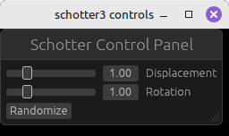
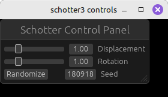

# Schotter3: Add a control panel with egui

Now that we have added parameters to control some of the Schotter behavior, for schotter3 let's add a control panel with buttons and sliders to control these parameters. Importantly, the control panel will also display the current values, which can allow us to reproduce the exact image at a later date. We will use the **egui** GUI, which is integrated with nannou.

As before, we create a new project in our Rust workspace with the command `cargo new schotter3`, which will create the directory "schotter3" with a "src" subdirectory and the project Cargo.toml file. Adding nannou as a dependency is a bit different from before because we need to enable the egui feature:

```
[dependencies]
nannou = { workspace = true, features = ["egui"] }
```

We still want to be able to save the generated image, and would like to do so without saving the control panel in the image, so we'll put the control panel in a second window. We start by creating that window.

The main window is created in the model function by calling new_window. We just copy that invocation and make a few changes to create a second window:

```
    let ui_window = app.new_window()
                .always_on_top(true)
                .title(app.exe_name().unwrap() + " controls")
                .size(280, 130)
                .view(ui_view)
                .key_pressed(key_pressed)
                .build();
```

Each window can have its own view and event functions. Here we set the view function to "ui_view". We use the same key_pressed function as for the main window so the keypresses we implemented in schotter2 will work even if the control panel window has the focus. The size is just a guess; we can adjust it later to make it fit the controls. Control panel development is often a process of trying some layout and then tweaking the placements and sizes to look right. We will need the window id when we create the User Interface, so we put it into a variable.

Next, we need to create the new `ui_view` function (which does nothing; the control panel needs to be displayed from the update function so it can change the model variables):

```
fn ui_view(_app: &App, _model: &Model) {}
```

We'll need the window to show a gui in it, so we need to add that to our model; nannou windows use the type `Entity`:

```
struct Model {
    ui_window: Entity,
```

Then in the model function, we include it in the model return struct:

```
Model {
    ui_window,
```

There is a problem with nannou version 0.20.0 that only allows egui controls to be displayed in first window that was created. The workaround is simple: make sure ui_window is created first. But to make sure the window where the schotter is displayed is the main window, we add `.primary()` to its new_window call. So here is the code to create the two windows:

```
    let ui_window = app.new_window()
                .always_on_top(true)
                .title(app.exe_name().unwrap() + " controls")
                .size(280, 130)
                .view(ui_view)
                .key_pressed(key_pressed)
                .build();
    let _window = app.new_window()
                .primary()
                .title(app.exe_name().unwrap())
                .size(WIDTH, HEIGHT)
                .view(view)
                .key_pressed(key_pressed)
                .build();
```

The egui library uses a GUI style called "immediate mode", where the GUI elements (called "widgets") are created and drawn as part of the update/draw loop, which works very well for programs like generative art and games. The alternative used by more traditional applications is "retained mode", where widgets are created during setup and maintained by the graphics library. This can be more efficient, but is also more complex since it requires synchronization between the data and widget states.

To begin, let's create a gui with a single "Randomize" button which will randomize the random_seed (just like typing "R"). We'll put the gui generation code in a separate function, `update_ui`, which needs two parameters, the app and the model (which will be updated, so needs to be mutable).

```
fn update_ui(app: &App, model: &mut Model) {
    let ctx = app.egui_for_window(model.window);
    egui::Window::new("Schotter Control Panel").show(&ctx, |ui| {
        if ui.add(egui::Button::new("Randomize")).clicked() {
            model.random_seed = random_range(0, 1000000);
        }
    });
}
```

The first line uses the `egui_for_window` function to get the "context" that we will use to add widgets. Then we create the control panel using `egui::Window::new("Schotter Control Panel")`. 

The next bit is some Rust magic, called a "closure". We won't get into the Rust details, but this is the syntax we need to build our control panel. The skeleton looks like this:

```
egui::Window::new("title").show(&ctx, |ui| {
    // Add widgets here
  });
```

We add a Randomize button with `ui.add(egui::Button::new("Randomize"))`. Then we use `.clicked()` to see if the user clicked the button. If so, we generate a new value for model.random_seed.

```
if ui.add(egui::Button::new("Randomize")).clicked() {
    model.random_seed = random_range(0, 1000000);
}
```

For our final step, we need to call `update_ui()` from `update()`; we'll add that as the very first line so we can get current values for all the variables:

```
fn update(_app: &App, model: &mut Model) {
    update_ui(app, model);
```

The control panel is now working, but let's add some code to close both windows if either window is closed. This goes at the beginning of `update`:

```
if app.window_count() < 2 {
    app.quit();
}
```

It's taken awhile to get here, but we finally have a very simple control panel. It only has one button, but adding more widgets is quite easy: just add `ui.add()` calls to `update_ui()`.

So let's step back and decide what we want our control panel to look like. There are a lot of possibilities, including adding exciting new functionality to the program, but let's keep it simple:
* the title at the top: "Schotter Control Panel" (already there)
* a slider labeled "Displacement" to control the square displacement (like the up/down arrows)
* a slider labeled "Rotation" to control the rotation (like the left/right arrows)
* the "Randomize" button that we've already built (but moved to the bottom of the control panel)

By default, egui adds new widgets from top to bottom, so we just need to add two sliders before the Randomize button. The Slider `new()` method takes two parameters: a mutable reference to the applicable variable and the range of values it accepts. It can also display an optional text to label the slider. So here is our new `update_ui()` function:

```
fn update_ui(app: &app, model: &mut Model) {
    let ctx = model.ui.begin_frame();
    egui::Window::new("Schotter Control Panel").show(&ctx, |ui| {
        ui.add(egui::Slider::new(&mut model.disp_adj, 0.0..=5.0).text("Displacement"));
        ui.add(egui::Slider::new(&mut model.rot_adj, 0.0..=5.0).text("Rotation"));
        if ui.add(egui::Button::new("Randomize")).clicked() {
            model.random_seed = random_range(0, 1000000);
        }
    });
}
```

We now have a working control panel!



That was a lot of effort! The control panel code is as complicated as the generative art code. Which begs the question: Is it worth the effort? There is no single answer. For just a few options, using key presses as we did in schotter2 (and which still work!) is a lot easier. But once the initial work is done, it is easy to add lots more parameters, which would be easier to manage with a control panel. If you expect other people to use your program, a control panel is more intuitive so probably worth the effort.

Another advantage of a control panel that isn't quite so obvious is that is shows the values of the parameters used. Knowing them is essential if you ever need to replicate a particular output of the program. (Of course, that assumes that you record the values! Perhaps adding a way to save the parameters along with the image would be even better.)

This is already long, but building on the potential need to replicate a particular output, we should show the current random seed value in the panel and allow it to be changed. We'll use another egui widget type for this: a DragValue. Since the seed value and the Randomize button are related, we'll put the DragValue widget to the right of the Randomize button. Widgets in egui are arranged vertically by default; to add a row of widgets, we use the `ui.horizontal()` method, which uses a closure just like the `show()` method:

```
ui.horizontal(|ui| {
  // Add widgets here
  });
```

DragValue widgets don't include an optional text feature like Slider widgets, so we need to add a label manually. For appearance, we also want some space between the Randomize button and the DragValue widget. So our `horizontal()` widget line looks like this:

```
ui.horizontal(|ui| {
    if ui.add(egui::Button::new("Randomize")).clicked() {
        model.random_seed = random_range(0, 1000000);
    }
    ui.add_space(20.0);
    ui.add(egui::DragValue::new(&mut model.random_seed));
    ui.label("Seed");
});
```

The finished control panel looks like this:



Next tutorial: [Schotter4](schotter4.md)
