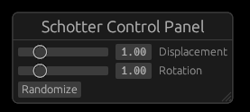
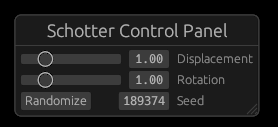

# Schotter3a: Add a control panel with egui

Now that we have added parameters to control some of the Schotter behavior, for schotter3 let's add a control panel with buttons and sliders to control these parameters. Importantly, the control panel will also display the current values, which can allow us to reproduce the exact image at a later date. In this version, we will use the **egui** GUI, which is integrated with Nannou using the nannou_egui crate.

We still want to be able to save the generated image, and would like to do so without saving the control panel in the image, so we'll put the control panel in a second window. We start by creating that window.

The main window is created in the model function by calling new_window. We just copy that invocation and make a few changes to create a second window:

```rust
let ui_window = app.new_window()
            .title(app.exe_name().unwrap() + " controls")
            .size(280, 130)
            .view(ui_view)
            .raw_event(raw_ui_event)
            .key_pressed(key_pressed)
            .build()
            .unwrap();
```

Each window can have its own view and event functions. Here we use "ui_view" to display the control panel and "raw_ui_event" to handle control panel events. We also use the same key_pressed function as for the main window so the keypresses we implemented in schotter2 will work even if the control panel window has the focus. The size is just a guess; we can adjust it later to make it fit the controls. Control panel development is often a process of trying some layout and then tweaking the placements and sizes to look right. We will need the window id when we create the User Interface, so we put it into a variable.

Next, we create the two functions we reference, leaving the bodies empty for now:

```rust
fn ui_view(_app: &App, _model: &Model, _frame: Frame) {}

fn raw_ui_event(_app: &App, _model: &mut Model, _event: &nannou::winit::event::WindowEvent) {}
```

If we compile and run now, Rust will warn us that ui_window is unused, but two windows will be created: the main one with the Schotter design and a small blank one where our controls will go. But there is actually a subtle bug: if you press 'S' while the control panel window is active, that window will be saved instead of the main window. To see why, let's look at the save code:

```rust
Key::S => {
    app.main_window()
        .capture_frame(app.exe_name().unwrap() + ".png");
}
```

While "app.main_window()" seems like it should return the main window, it actually returns the active one. This is acknowledged in the Nannou docs: 'TODO: Currently this produces a reference to the focused window, but this behaviour should be changed to track the "main" window (the first window created?)'. So this will probably be fixed in the future, but we don't want to wait! To fix this, we need to remember the id of the main window and make the save code use it instead of app.main_window().

First, we add a new field to the model; let's call it "main_window".

```rust
struct Model {
    main_window: WindowId,
```

Then we modify the model function. Instead of storing the main window id in "\_window", which is ignored since we don't need it when there is only one window, we store it in "main_window".

```rust
let main_window = app.new_window()
            .title(app.exe_name().unwrap())
```

And we include that in the model result:

```rust
Model {
    main_window,
```

Finally, we modify the save code to use the window associated with that window id as the window to save (checking that it is still open):

```rust
Key::S => {
    match app.window(model.main_window) {
        Some(window) => {
            window.capture_frame(app.exe_name().unwrap() + ".png");
        }
        None => {}
    }
}
```

Now we have a second window where we can put our control panel, so let's put a control panel in it. This will take quite a few steps, but adding new elements is fairly easy once we have the basic structure. To begin, let's put a single "Randomize" button in the middle which will randomize the random_seed (just like typing "R").

The egui library uses a GUI style called "immediate mode", where the GUI elements (called "widgets") are created and drawn as part of the update/draw loop, which works very well for programs like generative art and games. (The alternative used by more traditional applications is "retained mode", where widgets are created during setup and maintained by the graphics library. This can be more efficient, but is also more complex since it requires synchronization between the data and widget states.)

To create an egui GUI in Nannou, we need to add nannou_egui as a dependency to the Cargo.toml file (along with Nannou itself). Note that nannou_egui is not part of Nannou itself, so has a different version number.

```toml
[dependencies]
nannou = "0.18"
nannou_egui = "0.5"
```

Next, we add a use statement for the egui components we need at the beginning of the code:

```rust
use nannou_egui::{self, egui, Egui};
```

Now we can add the code for the ui_view() and raw_ui_event() functions we created earlier. The code is simple, and will be the same for any program that uses nannou_egui:

```rust
fn ui_view(_app: &App, model: &Model, frame: Frame) {
    model.ui.draw_to_frame(&frame).unwrap();
}

fn raw_ui_event(_app: &App, model: &mut Model, event: &nannou::winit::event::WindowEvent) {
    model.ui.handle_raw_event(event);
}
```

We then need to the ui to our model:

```rust
struct Model {
    ui: Egui,
```

Then, of course, we need to initialize the ui in our model function. We have the ui window id in `ui_window`, but egui needs a reference to the actual window, which we can get from the app. Then we can create the ui from the window.

```rust
let ui_window_ref = app.window(ui_window).unwrap();
let ui = Egui::from_window(&ui_window_ref);
```

After adding `ui` to the return struct, we now have a GUI we can use. Since egui is an immediate mode GUI, we create the widgets on every update. We'll create a separate function, update_ui(), to create the widgets. Right now, there is just the Randomize button.

```rust
fn update_ui(model: &mut Model) {
    let ctx = model.ui.begin_frame();
    egui::Window::new("Schotter Control Panel").collapsible(false).show(&ctx, |ui| {
        if ui.add(egui::Button::new("Randomize")).clicked() {
            model.random_seed = random_range(0, 1000000);
        }
    });
}
```

The first line calls the egui `begin_frame()` function to get the "context" that we will use to add widgets. Then we create the control panel using `egui::Window::new("Schotter Control Panel")`. When a GUI is being displayed in the same window as the graphics we are generating, it is convenient to be able to collapse the control panel to show more of the graphics. But since we are putting it in a separate window, that would just be confusing, so we add `.collapsible(false)` to disable it.

The next bit is some Rust magic, called a "closure". We won't get into the Rust details, but this is the syntax we need to build our control panel. The skeleton looks like this:

```rust
egui::Window::new("title").show(&ctx, |ui| {
    // Add widgets here
  });
```

We add a Randomize button with `ui.add(egui::Button::new("Randomize"))`. Then we use `.clicked()` to see if the user clicked the button. If so, we generate a new value for model.random_seed.

```rust
if ui.add(egui::Button::new("Randomize")).clicked() {
    model.random_seed = random_range(0, 1000000);
}
```

For our final step, we need to call update_ui() from update(); we'll add that as the very first line so we can get current values for all the variables:

```rust
fn update(_app: &App, model: &mut Model, _update: Update) {
    update_ui(model);
```

It's taken awhile to get here, but we finally have a very simple control panel. It only has one button, but adding more widgets is quite easy: just add `ui.add()` calls to update_ui().

So let's step back and decide what we want our control panel to look like. There are a lot of possibilities, including adding exciting new functionality to the program, but let's keep it simple:

- the title at the top: "Schotter Control Panel" (already there)
- a slider labeled "Displacement" to control the square displacement (like the up/down arrows)
- a slider labeled "Rotation" to control the rotation (like the left/right arrows)
- the "Randomize" button that we've already built (but moved to the bottom of the control panel)

By default, egui adds new widgets from top to bottom, so we just need to add two sliders before the Randomize button. The Slider new() method takes two parameters: a mutable reference to the applicable variable and the range of values it accepts. It can also display an optional text to label the slider. So here is our new update_ui() function:

```rust
fn update_ui(model: &mut Model) {
    let ctx = model.ui.begin_frame();
    egui::Window::new("Schotter Control Panel").collapsible(false).show(&ctx, |ui| {
        ui.add(egui::Slider::new(&mut model.disp_adj, 0.0..=5.0).text("Displacement"));
        ui.add(egui::Slider::new(&mut model.rot_adj, 0.0..=5.0).text("Rotation"));
        if ui.add(egui::Button::new("Randomize")).clicked() {
            model.random_seed = random_range(0, 1000000);
        }
    });
}
```

We now have a working control panel!



That was a lot of effort! The control panel code is more complicated than the generative art code. Which begs the question: Is it worth the effort? There is no single answer. For just a few options, using key presses as we did in schotter2 (and which still work!) is a lot easier. But once the initial work is done, it is easy to add lots more parameters, which would be easier to manage with a control panel. If you expect other people to use your program, a control panel is more intuitive so probably worth the effort.

Another advantage of a control panel that isn't quite so obvious is that is shows the values of the parameters used. Knowing them is essential if you ever need to replicate a particular output of the program. (Of course, that assumes that you record the values! Perhaps adding a way to save the parameters along with the image would be even better.)

This is already long, but building on the potential need to replicate a particular output, we should show the current random seed value in the panel and allow it to be changed. We'll use another egui widget type for this: a DragValue. Since the seed value and the Randomize button are related, we'll put the DragValue widget to the right of the Randomize button. Widgets in egui are arranged vertically by default; to add a row of widgets, we use the `ui.horizontal()` method, which uses a closure just like the `show()` method:

```rust
ui.horizontal(|ui| {
  // Add widgets here
  });
```

DragValue widget don't include an optional text feature like Slider widgets, so we need to add a label manually. For appearance, we also want some space between the Randomize button and the DragValue widget. So our `horizontal()` widget line looks like this:

```rust
ui.horizontal(|ui| {
    if ui.add(egui::Button::new("Randomize")).clicked() {
        model.random_seed = random_range(0, 1000000);
    }
    ui.add_space(20.0);
    ui.add(egui::DragValue::new(&mut model.random_seed));
    ui.label("Seed");
});
```

The finished control panel looks like this:


One final note. You're probably wondering where I got the values for the UI window size (280x130) and the space between the Randomize button and the seed value. I started with guesses, then adjusted them after running the program to find nice values. I'm sure there is some way to compute the exact values needed, but trial and error was easiest for me.

Next tutorial: [Schotter4a](schotter4a.md)
