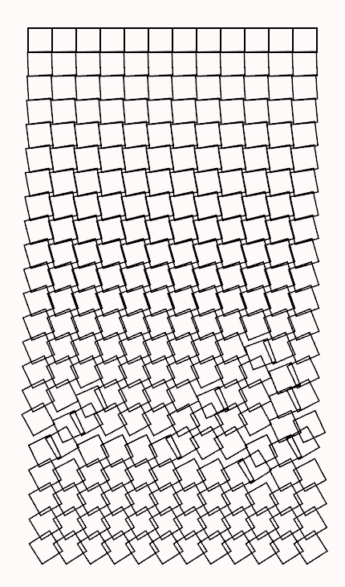
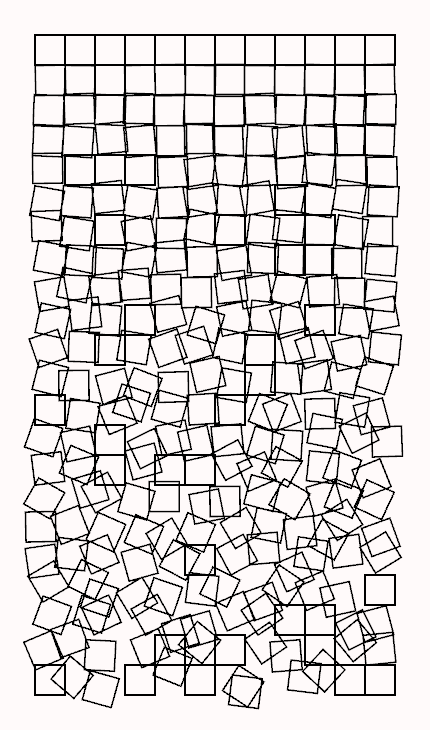

# Schotter4: Animate the squares

For schotter4, we'll animate the squares, making them move and rotate over time. We want the changes to be smooth, so we need to move and rotate the squares just a bit each iteration.

There are several ways to do the animation; here is the strategy we'll use here: We'll keep the existing fields of the Stone struct (x, y, x_offset, y_offset, and rotation) to mean the current state of the stone. The view() function can then remain exactly the same. To animate the squares, we'll add some velocity fields: x_velocity, y_velocity, and rot_velocity, and add the values of these fields to x_offset, y_offset, and rotation in the update function to move and rotate the square. We'll also add a counter named cycles to count down the number of times to use these velocity values; we'll change them when it reaches 0.

So here's the augmented Stone struct:

```rust
struct Stone {
    x: f32,
    y: f32,
    x_offset: f32,
    y_offset: f32,
    rotation: f32,
    x_velocity: f32,
    y_velocity: f32,
    rot_velocity: f32,
    cycles: u32,
}
```

We need to add these to the Stone::new() function as well to set their initial values. The update() function will reset the new fields to random values whenever cycles reaches 0, so we start it at 0 and let update() worry about randomizing the others.

```rust
impl Stone {
    fn new(x: f32, y: f32) -> Self {
        let x_offset = 0.0;
        let y_offset = 0.0;
        let rotation = 0.0;
        let x_velocity = 0.0;
        let y_velocity = 0.0;
        let rot_velocity = 0.0;
        let cycles = 0;
        Stone {
            x,
            y,
            x_offset,
            y_offset,
            rotation,
            x_velocity,
            y_velocity,
            rot_velocity,
            cycles,
        }
    }
}
```

We don't need to change the Model struct at all since it just keeps a vector of Stones. But we do need to change the loop mode. Since we want the main loop to iterate repeatedly for an animation, we change `wait()` to `refresh_sync()`. This will make Nannou synchronize running the update/view loop with the monitor's refresh rate (typically 1/60 second).

```rust
nannou::app(model).update(update).loop_mode(LoopMode::refresh_sync()).run()
```

The main changes to implement the animation are to the update() function. We keep the main for loop `for stone in &mut model.gravel`, but only want to randomize the stone when stone.cycles is 0. Rather than setting the offsets and rotation directly, we compute a new random "target": new_x, new_y, and new_rot, as well as a random number of cycles to reach it: new_cycles. We then compute the velocity values by subtracting the current from the new and dividing by the number of cycles.

If stone.cycles is greater than 0, we just add the velocity values to the current values to move the square towards its target and decrement cycles by 1. Here is the updated update() function:

```rust
fn update(_app: &App, model: &mut Model, _update: Update) {
    let mut rng = StdRng::seed_from_u64(model.random_seed);
    for stone in &mut model.gravel {
        if stone.cycles == 0 {
            let factor = stone.y / ROWS as f32;
            let disp_factor = factor * model.disp_adj;
            let rot_factor = factor * model.rot_adj;
            let new_x = disp_factor * rng.gen_range(-0.5..0.5);
            let new_y = disp_factor * rng.gen_range(-0.5..0.5);
            let new_rot = rot_factor * rng.gen_range(-PI / 4.0..PI / 4.0);
            let new_cycles = rng.gen_range(50..300);
            stone.x_velocity = (new_x - stone.x_offset) / new_cycles as f32;
            stone.y_velocity = (new_y - stone.y_offset) / new_cycles as f32;
            stone.rot_velocity = (new_rot - stone.rotation) / new_cycles as f32;
            stone.cycles = new_cycles;
        } else {
            stone.x_offset += stone.x_velocity;
            stone.y_offset += stone.y_velocity;
            stone.rotation += stone.rot_velocity;
            stone.cycles -= 1;
        }
    }
}
```

When we compile and run this, it starts out fine; the squares move gradually to random places. So we've done something right. But they don't stay random! The squares keep moving and form a fairly consistent pattern.



When I first coded this, I puzzled for awhile why it didn't produce random results. So kudos if you see the problem! Clicking Randomize makes the squares move to a new configuration, but still not very random. The problem is subtle. Remember back in schotter2 when we added a seeded random number generator to give consistent results each time through the loop? We still start each iteration of update() with the same seed, so get the same sequence of random numbers each time. It works fine the first time, when all of the cycles values are 0. But since cycles will then be different for each square, only a few will be 0 on subsequent iterations, so their randomness is greatly reduced.

Now that we are animating it, we don't want to repeat the random numbers. One way to fix this is to add rng, our seeded random number generator, to the model, initializing it with the seed in the model() function, and reinitializing it whenever we press 'R' or click Randomize. But it is probably easier just to abandon the seeded random number generator and use the Nannou random_range() function to generate them. Let's try that, replacing the four occurrences of `rng.gen_range()` with `random_range()` (also replacing the single range with two arguments):

```rust
  let new_x = disp_factor * random_range(-0.5, 0.5);
  let new_y = disp_factor * random_range(-0.5, 0.5);
  let new_rot = rot_factor * random_range(-PI / 4.0, PI / 4.0);
  let new_cycles = random_range(50, 300);
```

Now compiling will give some warnings about the unused library Rng and the unused variable rng, but it does appear to work like we expect. The squares constantly rotate and move around, forming continually changing random patterns. It's fun to watch. Changing the sliders doesn't have an immediate effect like before; squares still move to their original targets. But the new targets will be controlled by the new settings, so after a few seconds the effects of the changes will be seen.

Of course, the Randomize button now has no effect at all since we aren't using the seeded random number generator. The question is whether we should continue using random_range and clean up the rng code, or switch back to using the seeded random number generator, but in a more effective way. Let's imagine that we did switch back so clicking Randomize changed the stream of random numbers. How would the result change?

Well, when we click Randomize the target square positions would be different from the positions if we hadn't clicked Randomize. But they are still random, so it isn't a difference we would be able to see. Put another way, if we just looked at the main window and someone else controlled the control panel without us knowing what they did, we wouldn't be able to tell when they click Randomize. Changing the sliders would have a noticable effect after a few seconds, but not clicking Randomize.

So we no longer need the seeded RNG or the Randomize button. So let's clean up our code. Starting at the top, we first delete the two `use nannou::rand` lines since we no longer need to use that library. Then we delete the randomize, seed_label, and seed_text widgets from the widget_ids! macro. Struct Stone doesn't change, but we can delete random_seed from the model and the model() function (in two places). In update() we delete the `let mut rng =` line. In key_pressed(), we delete the `Key::R` block. Finally, in ui_event() we delete the Randomize button, Seed label, and Seed text codes.

Now compiling gives no warnings, and running the program works as we envisioned. Let's make some improvements. Right now, all of the squares (except for the top row) are in constant motion. Let's calm it down a bit by making the squares rest occasionally. We can stop a square from moving by setting the velocity values to 0. We'll do this randomly by adding the following code:

```rust
if stone.cycles == 0 {
    if random() {
        stone.x_velocity = 0.0;
        stone.y_velocity = 0.0;
        stone.rot_velocity = 0.0;
        stone.cycles = random_range(50, 300);
    } else {
      // generate new velocity values as before
```

A simple change, but I think it looks nicer when not all of the squares are moving at once. Of course, you may have a different opinion! And my opinion will change from time to time. So let's add a control to specify how often squares will be still. Instead of using random(), which just randomly returns true or false with a 50% chance, we'll use random_f32(), which returns a random value between 0 and 1, and compare that to a probability we will set with a slider.

First, we need to add a variable for this to Model. We'll call it "motion", and add it to the struct Model (I put `motion: f32,` between rot_adj and gravel), add a line `let motion = 0.5;` to the model() function, and include `motion,` in the correct place in our assignment to the_model. Then in update() we change `if random()` to `if random_f32() > model.motion`.

Now we add the slider (and a label for it). There is conveniently a space in the control panel since we deleted the Randomize button. Following the pattern we used in schotter3, we find widget_ids! and add `motion_label` and `motion_slider` to it. Then we add code to create the label and slider to ui_event():

```rust
// Motion label
widget::Text::new("Motion")
    .down_from(model.ids.rot_label, 10.0)
    .w_h(125.0, 30.0)
    .set(model.ids.motion_label, ui);

// Motion slider
for value in widget::Slider::new(model.motion, 0.0, 1.0)
    .right_from(model.ids.motion_label, 10.0)
    .w_h(150.0, 30.0)
    .label(&model.motion.to_string())
    .set(model.ids.motion_slider, ui)
{
    model.motion = value;
}
```

Now we can adjust the behavior to our liking. Setting Motion to 0 (no motion) stops all of the squares (after finishing their current cycle). Setting it to 1 (full motion) never stops squares from moving. If it is set a bit more than 0, it will be mostly still but with occasional movement. Playing with the controls, we can get some interesting effects. For example, I set Displacement and Rotation to 0 and waited for all the squares to go back to their home positions. Then I set Motion to 0 to stop everything and set Displacement and Rotation back to 1. Then I increased Motion to about 0.2 and waited a bit while some of the squares moved, and set it back to 0 to freeze it before some of the squares moved from their original positions, giving the following (which would not be possible with earlier schotter versions):



That image was captured by pressing 'S', which saves the frame to the file "schotter4.png" in the directory the program was started from. But it only saves one frame; how can we save a clip from the animation? Nannou doesn't provide a method for video capture, so instead we need to save a sequence of frames and use another program to generate a video from those frames. Let's implement this, using 'R' for "record" to both start and stop the recording.

In order to treat the sequence of images as a single thing, let's create a directory to store them in. Since Nannou doesn't provide access to a file selection dialog, we'll create a directory named "schotter4_frames" in the directory the program was started from. The image files themselves will be named "schotter####.png" where #### starts with 0001 and increases with each image. This convention is easy for video production programs to read.

We'll need to add three new items to the model:

- frames_dir: the name of the directory where the frames will be stored,
- cur_frame: an integer containing the current frame number to use in the file name, and
- recording: a boolean that is true if we are recording and false if not.

So we add three lines to `struct Model`:

```rust
frames_dir: String,
cur_frame: u32,
recording: bool,
```

In the model() function, we initialize them:

```rust
let frames_dir = app.exe_name().unwrap() + "_frames";
let recording = false;
let cur_frame = 0;
```

Then we put these in the appropriate place in the assignment to `the_model`.

In order to create the directory, we need to use the standard fs package. And we don't want to give an error if the directory already exists; to check for that we need to use io::ErrorKind. So we add these lines to the beginning of the program:

```rust
use std::fs;
use std::io::ErrorKind;
```

When the 'R' key is pressed, we first check to see if we are currently recording; if so we stop. Otherwise, we create the directory using the above code and initialize recording. Here is the code we add to key_pressed():

```rust
Key::R => {
    if model.recording {
        model.recording = false;
    } else {
        fs::create_dir(&model.frames_dir).unwrap_or_else(|error| {
            if error.kind() != ErrorKind::AlreadyExists {
                panic!{"Problem creating directory {:?}", model.frames_dir};
            }
        });
        model.recording = true;
        model.cur_frame = 0;
    }
}
```

The `fs::create_dir()` function will create the directory and return a `Result`, which is either `()` if it worked or an `Error` if there was a problem. The `unwrap_or_else()` will unwrap the `Result` and, if there was an error, process the error. Without this, an error would cause a panic, which is what we want if the error was unexpected but if the directory already exists we want to ignore it. So we look at the error kind and panic only if it isn't `AlreadyExists`.

Now we have the infrastructure needed to record a frame sequence; we just need to add code to do the actual recording. Since it needs to be done for each frame, we add it to update(), after the for loop.

First we increment cur_frame and use it to create the filename:

```rust
model.cur_frame += 1;
let filename = format!("{}/schotter{:>04}.png",
    model.frames_dir,
    model.cur_frame);
```

Then we copy the Key::S code from key_pressed() and change it to use the right filename:

```rust
match app.window(model.main_window) {
    Some(window) => {
        window.capture_frame(filename);
    }
    None => {}
}
```

Since update() now uses the "app" parameter, we need to remove the underscore from the parameter in the header. And we only capture frames if we are recording. But there are two subtle issues we need to incorporate:

- The Nannou loop rate is 60 times per second, but the typical video frame rate is 30 frames per second. So we only want to capture every other frame. We do this by checking if app.elapsed_frames() is even.
- We only use four digit frame numbers, so need to stop recording when cur_frame exceeds 9999. (That's just over five and a half minutes at 30 frames/second. If we want a longer video, we need to use more digits.)

Here is the final code segment added to update():

```rust
if model.recording && app.elapsed_frames() % 2 == 0 {
    model.cur_frame += 1;
    if model.cur_frame > 9999 {
        model.recording = false;
    } else {
        let filename = format!("{}/schotter{:>04}.png",
            model.frames_dir,
            model.cur_frame);
        match app.window(model.main_window) {
            Some(window) => {
                window.capture_frame(filename);
            }
            None => {}
        }
    }
}
```

Here's the result I got pressing 'R', waiting two seconds, and pressing 'R' again. I converted the resulting frame sequence to a GIF file using the open source video editor [Shotcut](https://shotcut.org/).


